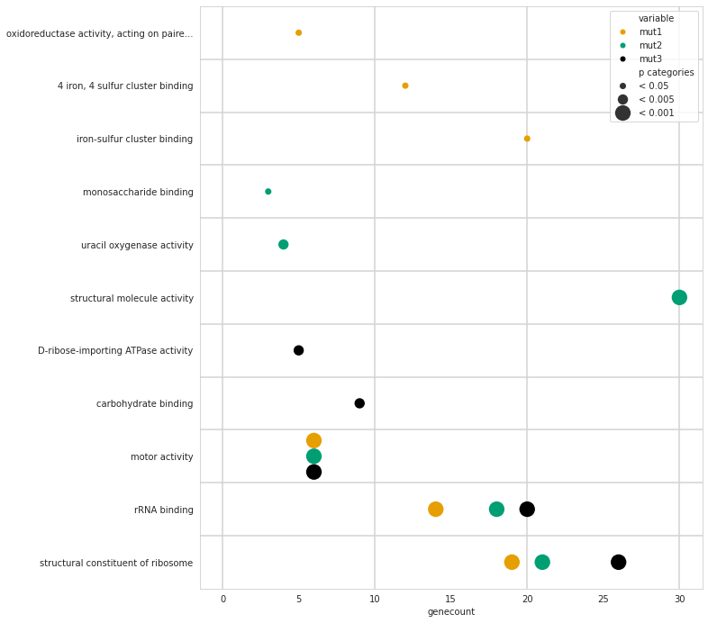

This python package handles different tasks for visualization in the postprocessing of RNASeq-Analyses. You can plot stacked bars of differentially expressed genes directly from the DESeq-output and plot enriched GOterms. 


![[plots/comb.png]]


- [Installation](#installation)
- [Plotting differentially expressed genes](#plotting-differentially-expressed-genes)
	- [Data preparation](#data-preparation)
	- [Visualize DEG from multiple experiments](#visualize-deg-from-multiple-experiments)
	- [Customize plotted data](#customize-plotted-data)
	- [Customize Visualization](#customize-visualization)
- [GO term enrichment](#go-term-enrichment)
	- [Preparing GOterms](#preparing-goterms)
	- [Seaborn scatterplot without overlapping dots](#seaborn-scatterplot-without-overlapping-dots)

# Installation

Download this repository and install the package rnanalysis it with pip using the following commands: 

```bash
cd rnanalysis
pip install .
```


# Plotting differentially expressed genes


Use this package  to plot differentially expressed genes from RNA sequencing experiments. 


![[plots/DESeq_results/example_colors.png|300]]

## Data preparation

Use the **class** ***rnaseqdata*** to prepare tables for comparing and visualizing DESeq data. It expects a list of csv-files with DESeq2 results and a list of names as input. 

```python
import os
from rnanalysis import rnaseqdata

example_data = 'examples/data/DESeq_tables/'
f = os.listdir(example_data)

filenames = [example_data+x for x in f]
datanames = [x.split('.')[0] for x in f]

data = rnaseqdata(filenames, datanames)

```


The returned object has several tables as attributes: 

| attribute                 | description                                                                                            |
| ------------------------- | ------------------------------------------------------------------------------------------------------ |
| data.table_log2change_all | table with all log2FoldChange values of all genes at all experiments                                   |
| data.table_padj_all       | table with all padj values of all genes at all experiments                                             |
| data.table_log2fold       | table with log2foldchange values where genes are above  log2foldchange cutoff and below padjust cutoff |
| data.table_padj           | table with padj values where genes are above  log2FoldChange cutoff and below padjust cutoff           |
| data.table_updown         | same as table_log2fold, but entries are 'up' and 'down' according to the sign of the log2FoldChange    |


Default thresholds are padj < 0.05 and log2foldchange > 1. You can change these filters if you want: 

```python
data = rnaseqdata(filenames, datanames,  padj=0.05, log2fold=1)
```


## Visualize DEG from multiple experiments


Use the  ***class*** ***compare*** to find out which genes are expressed in which experiment. The input is a table with expressed genes. 

```python
# create a comparison table 
from rnanalysis import compare
comp = compare(data.table_log2change)
```


The compare object has an attribute ***comp.table***, with number and ID of  genes that are found in the group but not in other experiments for each group of experiments. 


Plot the with the ***class*** ***compplot***. Optionally you can export the plot by specifying an outfile name
```python 
# plot the comparison table
from rnanalysis import compplot
compplot(comp.table, outfile='plots/DESeq_results/example1.png')
```


![[plots/DESeq_results/example1.png|300]]


## Customize plotted data


#### Remove experiments
You can provide a list of experiments to keep or experiments to remove to exclude experiments from the plots.
```python
# change included experiments with a whitelist
keep = datanames[:3]
comp = compare(data.table_log2change,keep=keep)

# change included experiments with a blacklist
remove = datanames[3]
comp = compare(data.table_log2change,remove=remove)

compplot(comp.table)
```

![[plots/DESeq_results/specify_experiments.png|200]]

#### Reorder experiments
Manipulate the comparison table, e.g. to reorder the experiments. 

```python
comp = compare(data.table_log2change,keep=keep)

# prepare a key function for reorderung the table 
neworder = neworder = [('wt',), ('mut1',), ('mut3',),  ('mut1', 'wt'), ('mut3', 'wt'),  ('mut3', 'mut1'), ('mut3', 'mut1', 'wt')]
keys = lambda col: col.map(lambda key: neworder.index(key))

# reorder the data
reordered_data = comp.table.sort_values(by='group_labels', key=keys )
compplot(reordered_data)
```

![[plots/DESeq_results/reordering.png|200]]

#### Separate up/down regulated genes
Plot up- and down-regulated genes as stacked bar.
```python
# divide up-/down-regulated genes 
comp = compare(data.table_log2change)
table_updown = comp.make_table_updown()
compplot(table_updown)
```

![[plots/DESeq_results/updown.png|300]]
#### Mark a custom list of genes 
 Specify a list of genes that you want to be marked in the plot: 
``` python
# get a list of genes to mark
comp = compare(data.table_log2change, keep=keep)
mark_genes = data.table_padj[data.table_padj['mut1'].notnull()]['ID']
mark_genes = mark_genes.to_list()

# mark genes in plot
table_marked_genes = comp.make_table_markedGenes(mark_genes)
compplot(table_marked_genes)
```

![[plots/DESeq_results/mark_genes.png|300]]

## Customize Visualization


There are several other options for customizing the plot. You can change the colors of the dots in the lower part, the bar colors, labels of the stacked bars (bar_names) and add a title. You can also save the file by specifying an outfile name. 

```python
compplot(table_marked_genes, 
		 title='regulated genes in different colors', 
		 bar_names={'marked':'some specific genes', 
					'unmarked':'other regulated genes'}, 
		 bar_colors={'marked':'teal', 
					 'unmarked':'maroon'}, 
		 dot_color='dimgrey')
```

![[plots/DESeq_results/example_colors.png|300]]

# GO term enrichment 

Use this package  to prepare tables for GOterm enrichment and to visualize the results. 


## Preparing GOterms

I downloaded the GO terms from [STRING](https://string-db.org/cgi/download?sessionId=baRWqSm9bX7G), the used terms are found in [GOterms_list.txt](example_data/GOterms/GOterms_list.txt). Extract a GOterms translation file from the list: 
```python
import rnanalysis.gotools as go

# Prepare the GOterms as a Dictionary with the genes as keys
terms_file = 'example_data/GOterms/GOterms_list.txt'
terms = go.get_GO_terms(terms_file)

# write terms for category *Molecular Function* to a file
go.write_gene2GO(terms,'Molecular Function', 'GOterms/Terms_Molecular_Function.txt')
```

This results in a file like [Terms_MF.txt](example_data/GOterms/Terms_MF.txt), which you can use for the enrichment analysis. To prepare a **GOuniverse** you can use this:
```python
import os 

# get a list of files to include in GOuniverse
tabledir = 'example_data/DESeq_tables/'
filelist = [os.path.join(tabledir, x) for x in os.listdir(tabledir)]

# collect the genes from that file
GOuniverse = go.genes_from_DESeqResults(filelist)

# write them to outfile 
with open('example_data/GOterms/GOuniverse.txt','w') as outf: 
    outf.write('\n'.join(GOuniverse))
```


#### enrich GOterms
I used [topGO](https://bioconductor.org/packages/release/bioc/vignettes/topGO/inst/doc/topGO.pdf) for analysing gene enrichment with [this R code](Goenrichment.r).


## Seaborn scatterplot without overlapping dots

I use matplotlib and seaborn to plot the enriched GOterms. But the plots were hard to read because some of the dots were overlapping. To solve this I wrote a workaround in which I added an extra collumn 'y_jitter' and changed the y-values so that the dots do not overlap in vertical orientation. The values of the x-axis are unchanged. 

Use gotools.enrichedGO.from_filenames to prepare a table  with p-values and genecounts for each enriched term. 
```python

import os
import rnanalysis.gotools as go

# get a list of files in a nice sorting.
# This sorting will be used for plotting order
example_data = 'example_data/GOenrichments/'
f = os.listdir(example_data)
f = sorted(f)[:-1] # excluding wt for a nicer demo image 

filenames = [example_data + x for x in f]
datanames = [x.split('.')[0] for x in f]

# set measure that you want to use for choosing the data to plot 
significance_column='weightFisher' 
significance_cutoff = 0.01

# process the data with p-values and genecounts for each enriched term
# this will also produce a column with categories for p-values 
enrichedTerms = go.enrichedGO.from_filenames(filenames, datanames, significance_column, significance_cutoff)
```


Then use  gotools.visualization.y_jitter to prepare an extra column for moving the dots on the y-axis so they do not overlap. Set the sizes of dots and rows as well as the horizontal order of dots. These will be used to calculated the y_jitter values.

``` python
import rnanalysis.gotools.visualization as viz

# set hrow height in inches. 
row_height_in_inches = 0.7 # change this value if you want higher / narrower rows 
figsize = (10, len(enrichedTerms.table)*row_height_in_inches)

# setting categorical dot sizes 
size_dict = {'< 0.05':50,  '< 0.005':130, '< 0.001':300,}
size_order = list(size_dict.keys())

# setting colors 
colors = { 'mut1': '#E69F00', 'mut2': '#009E73', 'mut3': 'black'}

# setting the horizontal order of labels and dots (from top to bottom)
hue_order = ['mut1', 'mut2', 'mut3']

# produce a new table with a column for non-overlapping dots
sorted_table = viz.y_jitter(figsize=figsize, 
                            df=enrichedTerms.table,
                            xcol='genecount', 
                            ycol='Term',
                            sizecol='p categories',
                            size_dict=size_dict, 
                            hue_order = hue_order)

```

You can use the new column for plotting. You can separate the overlapping dots with the function  ***y_jitter()***. Specify the column names of columns for x-axis, y-axis and size selection. Also specify size_dict dictionary, the figsize and the dataframe (df) that will be used. Optionally, you can give a hueorder that controls the jittering on the y axis to stack the dots in a particular order.  

```python
import seaborn as sns 
import matplotlib.pyplot as plt

# set plot style and figure size 
sns.set_style('whitegrid', {'axes.grid': False})
plt.figure(figsize=figsize)

# use seaborn for the actual plotting. 
sns.scatterplot(sorted_table, x='genecount', y='y_jitter', 
                size='p categories', sizes=size_dict, 
                size_order = size_order, 
                hue='variable', palette=colors,                
                zorder=3, linewidth=0, hue_order=hue_order)


# replace the y_jitter values with the original GOTerms on the y-axis
viz.set_y_ticks(enrichedTerms.table['Term'])

# set a nice grid on the y-axis above and below each GOTerm
viz.set_grid(enrichedTerms.table, x='genecount', y='Term')


plt.ylabel('')
plt.legend(loc='upper right')
plt.savefig('plots/GOenrichment/jittered.png', bbox_inches='tight')
plt.show()
```

![[plots/GOenrichment/jittered.png | 600]]


For comparison, here is the image without jittering:

![[simpleplot.png|600]]


