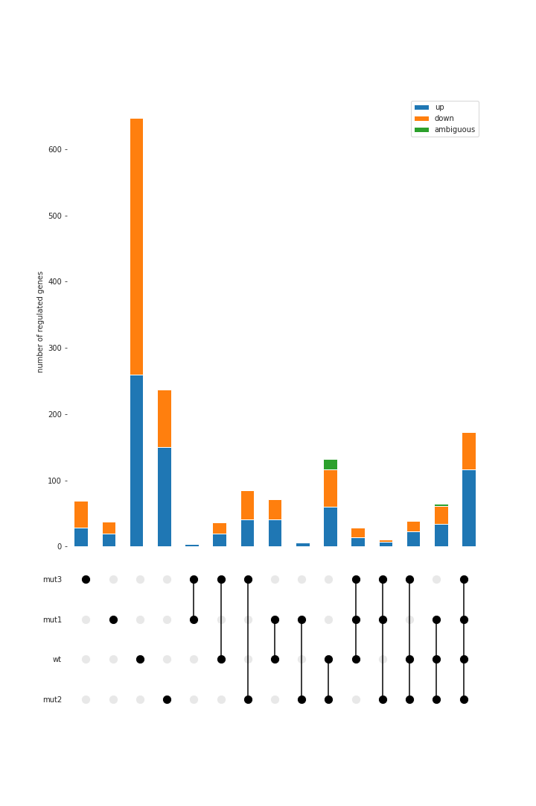

This is a python package for data visualization of RNA-Seq results


# Installation

Download the package form ?here? and install it with pip: 

```bash
cd rnanal
pip install .
```


# Plotting differentially expressed genes
This package is used to plot differentially expressed genes from RNA sequencing experiments. 


![[plots/DESeq_results/example_colors.png|300]]

## Installation


Download the package form ?here? and install it with pip: 

```bash
cd rnanalysis
pip install .
```


## Data preparation


Use the **class** ***rnaseqdata*** to prepare tables for comparing and visualizing DESeq data. It expects a list of csv-files with DESeq2 results and a list of names as input. 

```python
import os
from rnanalysis import rnaseqdata

example_data = 'examples/data/DESeq_tables/'
f = os.listdir(example_data)

filenames = [example_data+x for x in f]
datanames = [x.split('.')[0] for x in f]

data = rnaseqdata(filenames, datanames)

```


The returned object has several tables as attributes: 

| attribute                 | description                                                                                            |
| ------------------------- | ------------------------------------------------------------------------------------------------------ |
| data.table_log2change_all | table with all log2FoldChange values of all genes at all experiments                                   |
| data.table_padj_all       | table with all padj values of all genes at all experiments                                             |
| data.table_log2fold       | table with log2foldchange values where genes are above  log2foldchange cutoff and below padjust cutoff |
| data.table_padj           | table with padj values where genes are above  log2FoldChange cutoff and below padjust cutoff           |
| data.table_updown         | same as table_log2fold, but entries are 'up' and 'down' according to the sign of the log2FoldChange    |


Default thresholds are padj < 0.05 and log2foldchange > 1. You can change these filters if you want: 

```python
data = rnaseqdata(filenames, datanames,  padj=0.05, log2fold=1)
```


# Compare and visualize experiments


Use the  ***class*** ***compare*** to find out which genes are expressed in which experiment. The input is a table with expressed genes. 

```python
# create a comparison table 
from rnanalysis import compare
comp = compare(data.table_log2change)
```


The compare object has an attribute ***comp.table***, with number and ID of  genes that are found in the group but not in other experiments for each group of experiments. 


Plot the with the ***class*** ***compplot***. Optionally you can export the plot by specifying an outfile name
```python 
# plot the comparison table
from rnanalysis import compplot
compplot(comp.table, outfile='plots/DESeq_results/example1.png')
```


![[plots/DESeq_results/example1.png|300]]


# Customize data extraction


You can provide a list of experiments to keep or experiments to remove to exclude experiments from the plots.


```python
# change included experiments with a whitelist
keep = datanames[:3]
comp = compare(data.table_log2change,keep=keep)

# change included experiments with a blacklist
remove = datanames[3]
comp = compare(data.table_log2change,remove=remove)

compplot(comp.table)
```

![[plots/DESeq_results/specify_experiments.png|300]]


Manipulate the comparison table, e.g. to reorder the experiments. 

```python
comp = compare(data.table_log2change,keep=keep)

# prepare a key function for reorderung the table 
neworder = neworder = [('wt',), ('mut1',), ('mut3',),  ('mut1', 'wt'), ('mut3', 'wt'),  ('mut3', 'mut1'), ('mut3', 'mut1', 'wt')]
keys = lambda col: col.map(lambda key: neworder.index(key))

# reorder the data
reordered_data = comp.table.sort_values(by='group_labels', key=keys )
compplot(reordered_data)
```

![[plots/DESeq_results/reordering.png|300]]

Plot up- and down-regulated genes as stacked bar.

```python
# divide up-/down-regulated genes 
comp = compare(data.table_log2change)
table_updown = comp.make_table_updown()
compplot(table_updown)
```

![[plots/DESeq_results/updown.png|300]]

 Specify a list of genes that you want to be marked in the plot: 
``` python
# get a list of genes to mark
comp = compare(data.table_log2change, keep=keep)
mark_genes = data.table_padj[data.table_padj['mut1'].notnull()]['ID']
mark_genes = mark_genes.to_list()

# mark genes in plot
table_marked_genes = comp.make_table_markedGenes(mark_genes)
compplot(table_marked_genes)
```

![[plots/DESeq_results/mark_genes.png|300]]

## Visual Cusomization


There are several other options for customizing the plot. You can change the colors of the dots in the lower part, the bar colors, labels of the stacked bars (bar_names) and add a title. You can also save the file by specifying an outfile name. 

```python
compplot(table_marked_genes, 
		 title='regulated genes in different colors', 
		 bar_names={'marked':'some specific genes', 
					'unmarked':'other regulated genes'}, 
		 bar_colors={'marked':'teal', 
					 'unmarked':'maroon'}, 
		 dot_color='dimgrey')
```

![[plots/DESeq_results/example_colors.png|300]]

# GO term enrichments 


## Preparing GOterms

### Prepare genes->GOterms tables

Downloaded GO terms *list of terms associated with proteins used in the STRING enrichment* from [STRING](https://string-db.org/cgi/download?sessionId=baRWqSm9bX7G), the used terms are found in [176299.protein.enrichment.terms.v12.0.txt](additional_documents/)

The gotools.prepareGOterms module can help you get from the downloaded list to a file that translates genes into GO-terms


Prepare the GOterms as a Dictionary with the genes as keys:
```python
from gotools.prepareGOterms import get_GO_terms

terms_in = 'GOterms/176299.protein.enrichment.terms.v12.0.txt'
terms = get_GO_terms(terms_in)
```

The result will be a dictionary with a list of GOTerms for each key
```python
print(terms['Atu0001'])
> {'Protein Domains and Features': ['IPR005177', 'IPR026565'],
>  'Molecular Function': ['GO:0000166', 'GO:0003824', ... ],
>  'Cellular Component': ['GO:0005622', 'GO:0005737', ... ]}
```

You can write this to a file for a the GOterm category *Molecular Function* like this:
```python
from gotools.prepareGOterms import write_gene2GO
write_gene2GO(terms,'Molecular Function', 'GOterms/Terms_Molecular_Function.txt')
```
This results in a file like [Terms_Molecular_Function.txt](Terms_Molecular_Function.txt), which you can use for the enrichment analysis


### Prepare GOuniverse

Prepare a list of input files that give the names of all genes expressed in the conducted experiments to be used in the GO enrichment analysis

```python

from gotools.prepareGOterms import genes_from_DESeqResults
import os 

# get a list of files to include in GOuniverse
tabledir = 'additional_documents/DESeq_tables/'
filelist = [tabledir+x for x in os.listdir(tabledir) if x.endswith('_all.csv')]


# collect the genes from that file
GOuniverse = genes_from_DESeqResults(filelist)

# write them to outfile 
with open('GOterms/GOuniverse.txt','w') as outf: 
    outf.write('\n'.join(GOuniverse))
    
```


## GOterm enrichment with R

I used [topGO](https://bioconductor.org/packages/release/bioc/vignettes/topGO/inst/doc/topGO.pdf) for analysing gene enrichment. The code along with several comments can be found at [GO_trial_2.nb.html](scripts/GO_trial_2.nb.html)

An example for the category *Biological Process* can be found at [LO.H2O2_lsrB.H2O2.csv](LO.H2O2_lsrB.H2O2.csv)


## Visualize GO enrichment

The ***class enrichedGO*** can be used to prepare the enrichment results for visualization. You can initialize an instance directly with a list of files, or create that filelist with a list of file names

Prepare these imports:
```python

from gotools.postprocessing import enrichedGO
from gotools.visualization import y_jitter,  set_grid, set_y_ticks
import matplotlib.pyplot as plt
import seaborn as sns
```


### Prepare the data

First prepare a list of filenames and a list of data names. The GOterms in the plot will be ordered according to these two lists 

```python
files = ['GOenriched/biological_process/WT.no_LO.no.csv', 
		 'GOenriched/biological_process/WT.no_lsrB.no.csv', 
		 'GOenriched/biological_process/WT.no_oxyR.no.csv']
data_names = ['LO', 'lsrB', 'oxyR']
```

Initialize an enrichedGO object: 
```python
# set measure that you want to use for choosing the data to plot 
measure='weightFisher' 
significance_cutoff = 0.01 

# process the data with p-values and genecounts for each enriched terms
enrichedTerms = enrichedGO.from_filenames(files,data_names, measure, significance_cutoff)
```

You can also initialize the object directly with a dictionary of {data_name:data}
```python
data = {d : pd.read_table(f, sep='\t') for d,f in zip(data_names,files)}
enrichedTerms = enrichedGO(data, measure, significance_cutoff)
```

The attribute ***enrichedTerms.table*** is a pd.DataFrame with measure values and genecounts of all siognificantly enriched GOTerms. The entries in the table are ordered according to the groups, (eg   (e1) (e2) (e3) (e1,e2) (e1,e3) ... ). 


#### Customizing the order of combinations

You can print out the orders of combinations that is used: 
```python
enrichedTerms = enrichedGO.from_filenames(files,data_names, measure, significance_cutoff, combinations = 'print')

>>> [('LO',), ('lsrB',), ('oxyR',), ('LO', 'lsrB'), ('LO', 'oxyR'), 
     ('lsrB', 'oxyR'), ('LO', 'lsrB', 'oxyR')]
```

You can also change the order of combinations
``` python
custom_comb = [('lsrB', 'oxyR', 'LO'), ('lsrB',), ('oxyR',),  ('LO',),   
               ('lsrB', 'oxyR'),  ('lsrB', 'LO'), ('oxyR', 'LO')]
enrichedTerms = enrichedGO.from_filenames(files,data_names, measure, significance_cutoff, combinations = custom_comb)
```


### Plotting 


You should specify different variables for the plotting: 

```python
# setting colors
colors = {'LO': '#56B4E9', 'lsrB': '#E69F00', 'oxyR': '#009E73', 'WT' : 'black'}
hue_order = data_names

# setting dot sizes
size_dict = {'< 0.05':50,  '< 0.005':130, '< 0.001':300,}
size_order = list(size_dict.keys())

# setting the size of the plot
row_height_in_inches = 0.5
figsize = (10, len(enrichedTerms.table)*row_height_in_inches)
plt.figure(figsize=figsize)

```

You can now plot your results if you want, but the points will be overlapping: 
```python 
#setting the plot style
sns.set_style('whitegrid', {'axes.grid': False})
plt.figure(figsize=figsize)

sns.scatterplot(enrichedTerms.table, x='genecount', y='Term', 
                size='p categories', sizes=size_dict, 
                size_order = size_order, 
                hue='variable', palette=colors,
                hue_order=hue_order)
plt.show()
```


The ***function y_jitter*** will help you to solve the problem of overlapping dots by creating an extra column 'y_jitter' with values for jittering along the y-axis. 

Specify the column names of columns for x-axis, y-axis and the column that will be used for sizecol. Also give the size_dict dictionary, the figsize and the dataframe (df) that will be used. 
Optionally, you can give a hueorder that controls the jittering on the y axis to stack the dots in a particular order.  

```python
sorted_table = y_jitter(figsize=figsize, df=enrichedTerms.table, 
                        xcol='genecount', ycol='Term', 
                        sizecol='p categories', size_dict=size_dict, 
                        hue_order = hue_order)

```

Now you can use the new column for plotting 


```python

#setting the plot style
sns.set_style('whitegrid', {'axes.grid': False})
plt.figure(figsize=figsize)

# produce an extra column 'y_jitter'   
sorted_table = y_jitter(figsize=figsize, df=enrichedTerms.table, 
                        xcol='genecount', ycol='Term', 
                        sizecol='p categories', size_dict=size_dict, 
                        hue_order = hue_order)

# use seaborn for the actual plotting. 
sns.scatterplot(enrichedTerms.table, x='genecount', y='y_jitter', 
                size='p categories', sizes=size_dict, 
                size_order = size_order, 
                hue='variable', palette=colors,                
                zorder=3, linewidth=0, hue_order=hue_order)

# set a nice grid, yaxis, title and ylabel
set_grid(enrichedTerms.table, x='genecount', y='Term')
set_y_ticks(enrichedTerms.table['Term'])
plt.title('enriched GOTerms for Biological Process')
plt.ylabel('')

plt.show()
```


